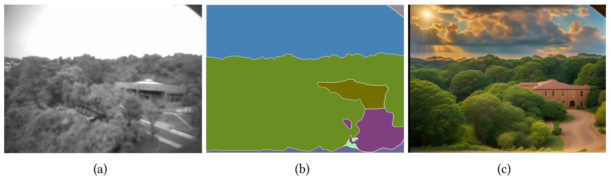
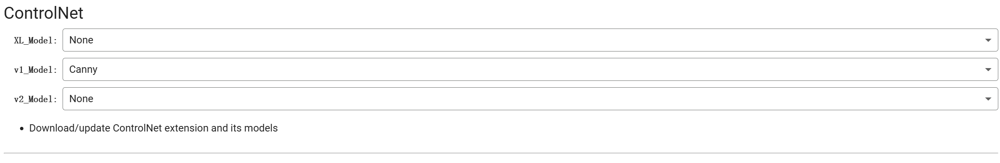

Guide to ControlNet

ControlNet is a hyper neural network designed to enhance image generation in Stable Diffusion by incorporating additional spatial constraints. For more information, you can refer to the research paper [Adding Conditional Control to Text-to-Image Diffusion Models](https://arxiv.org/abs/2302.05543).

ControlNet can be used to add spatial constraints from low-res monochrome image from the camera. The process can be 
illustrated here.

Spatial constriants can be added to the model generation by either Canny Edge Detector or OneFormer Segmentation.

OneFormer will label what kind of objects are in the reference image and the stable diffusion model can generate images with same kind of objects as the camera input.

Canny Edge Detector extract edge in the camera input based on the threshold.
