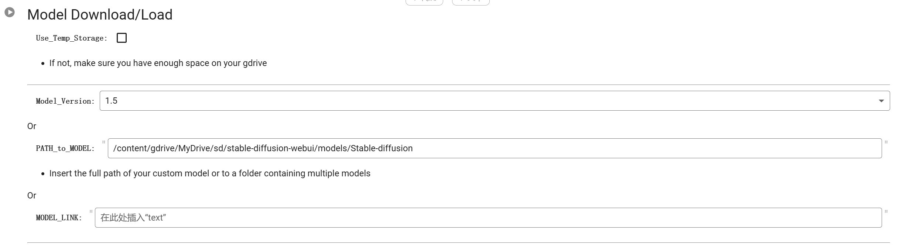
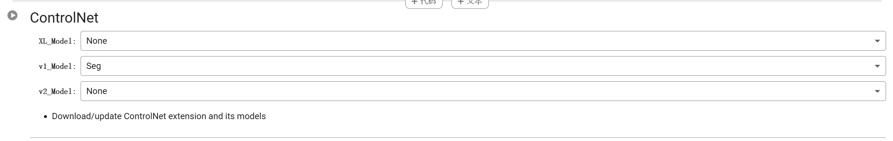
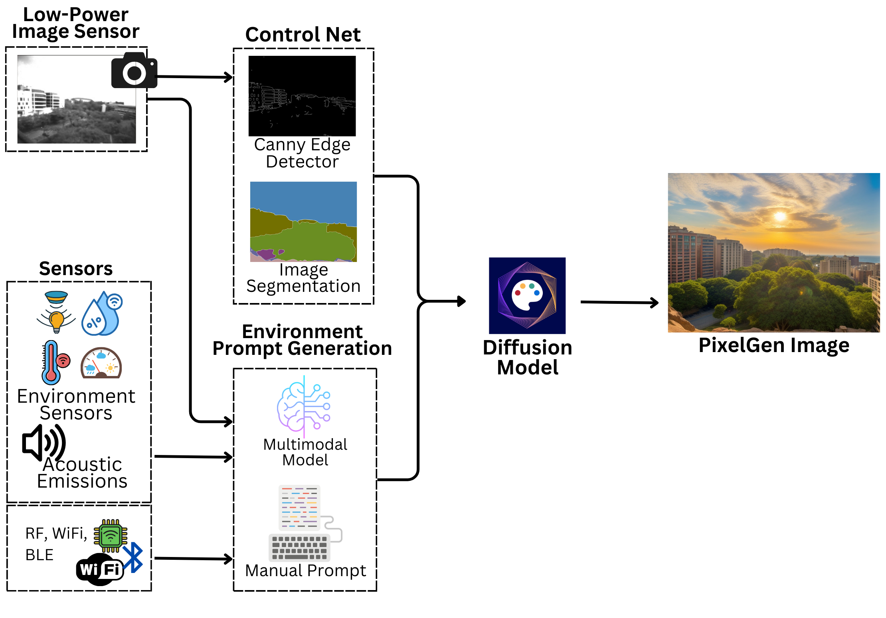

Guide to Running Stable Diffusion on Google Colab with AUTOMATIC1111

AUTOMATIC1111 is a feature-rich GUI for Stable Diffusion, offering text-to-image, image-to-image, upscaling, depth-to-image, and custom model capabilities. This guide simplifies the process of using AUTOMATIC1111 on Google Colab, eliminating the need for local installation.

Note: A paid Google Colab plan is required to use WebUI.

Instructions:

Obtain a paid Google Colab subscription.

Run the initial code block to link your Google Drive. You'll need to enter your password for authentication.

Execute the second and third code blocks to set up the necessary requirements.

Run the fourth block to acquire the Stable Diffusion V1.5 Model or indicate its location in your Google Drive.

Execute the sixth block twice to download both the Canny Edge and Segmentation ControlNet V1 Models. The fifth block for LoRA download is optional.

Run the final block to launch the interface.

This method offers a straightforward way to access AUTOMATIC1111's extensive features without dealing with complex installation procedures
